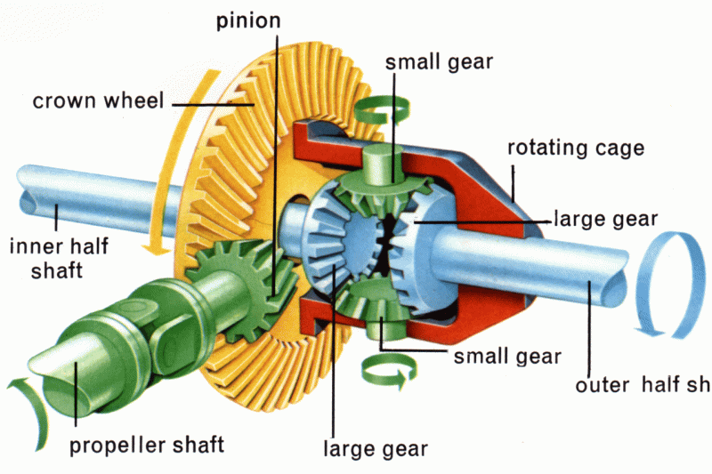
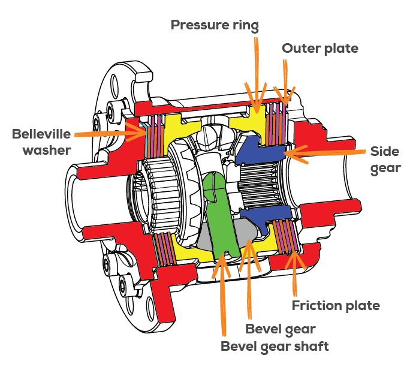
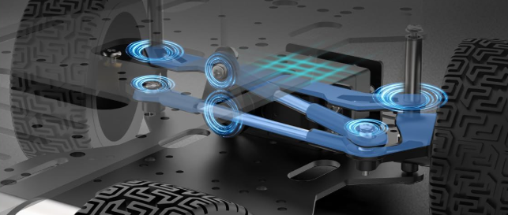
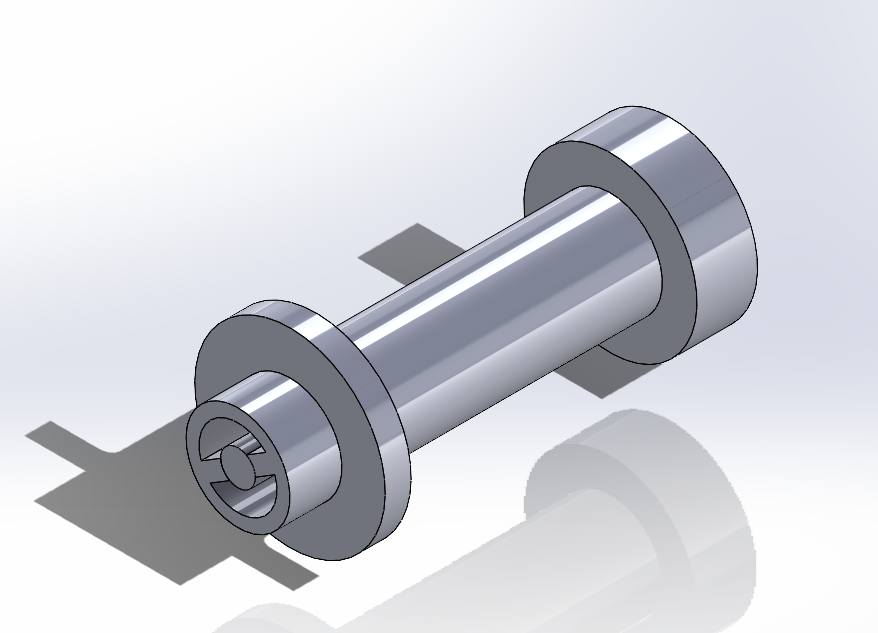
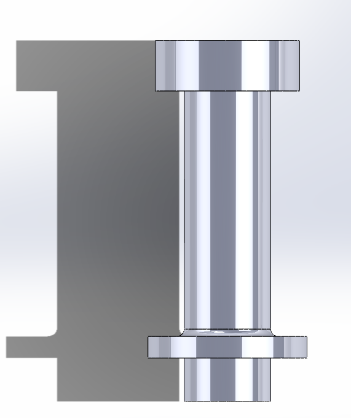
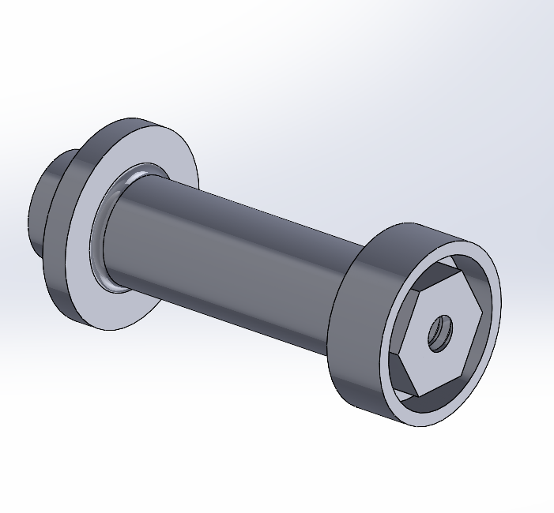
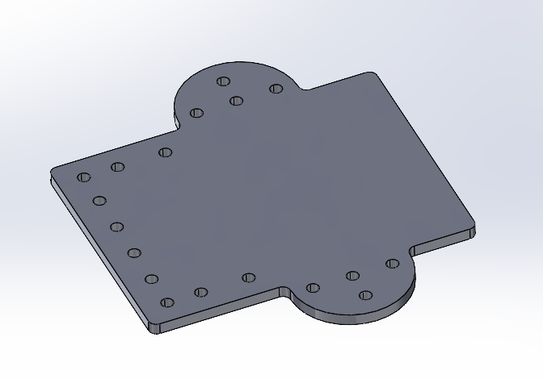

## <center>RoboPegasus Team Report for WRO Future Engineers Category (2025)</center>
<p align="center">
  
</p>


<p align="center">
  <strong>🏆 WRO Future Engineers 2025 Competition Entry</strong><br>
  Advanced Autonomous Navigation Robot
</p>

---

# 📋 Table of Contents

## 🚀 [Getting Started](#quick-start)
- [Repository Access & Requirements](#repository-access)
- [Video Demonstrations](#video-demonstrations)
- [Key Features Overview](#key-features)

## 📁 [Project Structure](#repository-structure)
- [Repository Organization](#file-organization)
- [Content Overview](#content-overview)

## 🔧 [Technical Documentation](#technical-documentation)

### ⚙️ [Robot Mechanisms](#robot-mechanisms)
- [Differential Gears](#differential-gears)
  - [Types of Differentials](#types-of-differentials)
  - [Benefits of Differential Gears](#benefits-of-differential-gears)
- [Ackermann Steering](#ackermann-steering)
  - [How It Works](#how-it-works)
  - [Main Purpose](#main-purpose)
- [Mechanism Integration](#fusion-between-differential-gears-and-ackermann-steering)
  - [Experiments Conducted](#experiments-conducted)
- [Implementation Details](#mechanisms-implementaion)
  - [Open Differential Implementation](#open-differential-implementation)
  - [Back Plexi Component](#1-back-plexi-component)
  - [Differential Replica](#2-differential-replica)
  - [Axis Component](#3-axis-component)
  - [Axis Holder](#4-axis-holder)
  - [Differential Holder](#5-differential-holder)
  - [Motor Holder](#6-motor-holder)
  - [Final Assembly](#6-final-assembly)
- [Ackermann Steering Implementation](#ackermann-steering-implementation)
  - [Original Kit Limitations](#original-kit-limitations-and-design-constraints)
  - [Custom Design Solution](#custom-plexi-glass-plate-design-and-manufacturing)
  - [Manufacturing Process](#manufacturing-process-and-quality-control)
  - [Performance Validation](#integration-benefits-and-performance-validation)

### 🚗 [Vehicle Design](#vehicle-main-body)
- [Main Body Design](#vehicle-main-body)
  - [Design Philosophy](#complete-from-scratch-design-philosophy)
  - [Manufacturing Techniques](#advanced-manufacturing-techniques)
  - [Precision Engineering](#precision-engineering-the-differential-challenge)
  - [Steering Integration](#ackermann-steering-integration)
- [Design Evolution](#evolution-through-iteration-learning-from-the-first-prototype)
  - [First Prototype Challenges](#first-prototype---design-challenges)
  - [Second Generation](#the-perfected-second-generation)
  - [Structural Redesign](#complete-structural-redesign)
  - [Power Management Revolution](#revolutionary-power-management-system)
- [Virtual Robot](#virtual-robot)
  - [CAD Modeling](#cad-design-and-modeling-philosophy)
  - [System Visualization](#complete-system-visualization)
  - [Architecture Design](#multi-tiered-architecture-design)
  - [Engineering Validation](#engineering-validation-through-virtual-modeling)
- [Design Lessons](#robots-design-lessons)

### 🏃 [Mobility Management](#mobility-management)
- [Motor Selection](#motor-selection-and-implementation)
  - [Drive Motor Specifications](#primary-drive-motor-jga25-370-245-rpm-dc-motor)
  - [Steering Actuator](#steering-actuator-mg996r-servo-motor)
  - [Control Implementation](#motor-control-implementation)
- [Chassis Design](#chassis-design-and-structural-implementation)
  - [Material Selection](#material-selection-and-structural-philosophy)
  - [Multi-Level Configuration](#multi-level-chassis-configuration)
  - [Component Integration](#component-integration-and-mounting-strategy)
- [Performance Analysis](#engineering-principles-and-performance-analysis)

### ⚡ [Power and Sense Management](#power-and-sense-management)
- [Battery System](#battery-specifications-and-power-analysis)
  - [Primary Power Source](#primary-power-source-zeee-li-poly-battery)
  - [Power Analysis](#power-consumption-analysis-and-runtime-calculations)
  - [Runtime Calculations](#component-power-consumption-summary)
- [Power Management System](#power-management-system-pms)
  - [Distribution Architecture](#custom-power-distribution-architecture)
  - [Star Topology](#star-topology-power-distribution)
- [Sensor Systems](#sensor-integration-and-selection-rationale)
  - [Ultrasonic Array](#ultrasonic-sensor-array-hc-sr04)
  - [Dynamic Positioning](#dynamic-sensor-positioning-sg90-servo-motors)
  - [Inertial Measurement](#inertial-measurement-mpu6050-imu)
  - [Infrared Detection](#infrared-detection-ir-sensor)
- [Processing Systems](#primary-processing-systems)
  - [Arduino Mega Implementation](#arduino-mega-2560-sensor-interface-and-control)
  - [Raspberry Pi Setup](#raspberry-pi-5-computer-vision-processing)

### 🚧 [Obstacle Management](#obstacle-management)
- [Open Challenge Algorithm](#autonomous-robot-navigation-algorithm-for-open-challenge)
  - [Algorithm Flow](#algorithm-flow)
  - [Algorithm Structure](#algorithm-structure)
  - [Control Parameters](#control-parameters)
  - [Mission Completion](#mission-completion-criteria)
- [Obstacle Challenge System](#obstacle-challenge-navigation-system)
  - [Startup Protocol](#startup-from-the-parking-lot)
  - [Directional Determination](#directional-determination-algorithm)
  - [CCW Navigation](#counter-clockwise-ccw-navigation-mode)
  - [CW Navigation](#clockwise-cw-navigation-mode)
  - [Corner Positioning](#corner-positioning-protocol)
  - [Pillar Navigation](#navigation-through-pillars)
- [Computer Vision](#pillar-color-detection-methodology)
  - [Detection Algorithm](#color-detection-algorithm)
  - [Pillar Classification](#pillar-configuration-classification)
  - [Error Handling](#error-handling-and-edge-cases)

## 👥 [Project Information](#project-information)
- [Contributing Guidelines](#contributing)
  - [How to Contribute](#how-to-contribute)
  - [Contribution Areas](#contribution-areas)
  - [Code Standards](#code-standards)
- [Team Contact](#team-contact)
  - [Team Members](#team-members)
  - [Contact Information](#contact-information)

---


## Quick Start

### Repository Access
**Important Note:** If accessing this GitHub repository from a restricted area, a VPN must be used for proper content display and functionality.

### Video Demonstrations
- **Open Challenge:** [Watch on YouTube (Coming Soon)](https://youtu.be/jW7eVu1ZF-4)
- **Obstacle Challenge:** [Watch on YouTube (Coming Soon)](https://youtu.be/LZvUotCrMSs)

### Key Features
- ✅ **Custom Differential Drive System** - From-scratch mechanical design
- ✅ **Ackermann Steering Integration** - Precision turning mechanics  
- ✅ **Advanced Sensor Array** - 7 ultrasonic sensors + IMU + camera
- ✅ **Dual-Processor Architecture** - Arduino Mega + Raspberry Pi 5
- ✅ **Professional Power Management** - Custom PMS with star topology
- ✅ **Computer Vision** - Real-time pillar detection and classification
- ✅ **Autonomous Navigation** - Multi-algorithm approach for different challenges

---

## Repository Structure

### File Organization
```
📦 RoboPegasus-WRO-2025/
├── 📁 t-photos/           # Team photos (official + fun)
├── 📁 v-photos/           # Vehicle photos (6 angles + generations) and Virtual Robot Photos
│   ├── 📁 First_Generation_Robot (Not Used)/
│   └── 📁 Second_Generation_Robot (Used in Competition)/
├── 📁 video/              # Video demonstrations and links
├── 📁 schemes/            # Electrical schematics and diagrams
├── 📁 src/                # Source code for all components
├── 📁 models/             # 3D printed and laser cut parts
├── 📁 other/              # Additional resources
│   ├── 📁 images/         # Documentation images
│   ├── 📁 files/          # Simulation and instruction files
│   └── 📁 gif files/      # Algorithm demonstration GIFs
├── 📄 README.md           # This comprehensive documentation
├── 📄 LICENSE             # Project license
```

### Content Overview
This repository represents RoboPegasus team's complete engineering solution for the WRO Future Engineers Category competition in 2025. It includes all necessary documentation, code, models, and materials used in the design, construction, and programming of our autonomous robot.

Our focus has been on creating a robust and efficient vehicle capable of navigating complex tracks with obstacles, adhering to competition rules, and demonstrating advanced engineering skills through innovative mechanical design and sophisticated software algorithms.

---

# Technical Documentation

# Robot Mechanisms

In self-driving cars, the most important aspect is their mechanical mechanisms, which ensure smooth and safe operation. Our design incorporates differential gears for the Rear-Wheel Drive (RWD) system, providing balance and control during turns. For steering, we utilize a Ackermann Steering mechanism, which offers precise control and reliability.

## Differential Gears


Differential gears play a crucial role in automotive engineering. They allow the wheels on a vehicle to rotate at different speeds, particularly when the car is turning. This functionality is vital because the inner wheels travel a shorter distance than the outer wheels during a turn.

The following **HTML** file simulates how Differential Gears work:
- [Differential Gears Simulation](other\files\differential_simulation.html)

**Note:** You will have to download the file and open it using your prefferd browser to access the simulation.

### Types of Differentials

1. **Open Differential**: is the most common type, found in many non-performance vehicles. It is simple and cost-effective but can transfer torque to a wheel without traction, causing it to spin uselessly.

<p align="center">
  
</p>

2. **Locking Differential**: Often used in off-road vehicles, this type can lock the wheels to spin at the same speed, providing better traction on uneven surfaces.

<p align="center">
  
</p>

3. **Limited-Slip Differential (LSD)**: Combines features of both open and locking differentials, allowing wheels to spin at different speeds but can transfer more torque to the wheel with better traction.

<p align="center">
  
</p>

### Benefits of Differential Gears

- **Improved Handling**: Differentials enhance vehicle handling, especially around corners, by allowing wheels to rotate at appropriate speeds.
- **Increased Traction**: Locking and limited-slip differentials provide better traction on slippery or uneven surfaces.
- **Enhanced Stability**: They improve stability by distributing power evenly to the wheels, preventing loss of control.

## Ackermann Steering

The following **HTML** file simulates how Ackermann Steering Mechanism work:
- [Ackermann Steering Mechanism Simulation](other\files\ackermann_steering_sim.html)  

**Note:** You will have to download the file and open it using your prefferd browser to access the simulation.


<p align="center">
  
</p>


Ackermann Steering is a geometric arrangement of linkages in the steering system of a vehicle designed to avoid the problem of tire slipping during turns. Its primary goal is to ensure that all wheels of a vehicle follow concentric circular paths with different radiuses, which allows for smoother and more efficient turning.

### How It Works:
- When a vehicle turns, the inner and outer front wheels trace different arcs. The inner wheel needs to turn at a sharper angle than the outer wheel.
- The Ackermann steering geometry links the steering arms such that the front wheels pivot about different angles, aligning with their respective turning circles.
- This prevents tire scrubbing, reduces wear, and improves handling and safety.
<p align="center"> 
   
</p>

### Main Purpose:
- **Reduce Tire Slippage:** By ensuring the wheels roll along the correct turning paths without lateral slipping.
- **Improve Steering Accuracy:** Helps vehicles maintain better control, especially during sharp turns.
- **Enhance Safety:** Precise steering response reduces the risk of skidding or losing control.
- **Increase Efficiency:** Minimizes energy loss from friction and tire wear, improving fuel economy and tire lifespan.

## Fusion Between Differential Gears and Ackermann Steering

After extensive experimentation and careful analysis, we found that combining Ackermann steering with differential gears provides the best control and maneuverability for our robot.

### Experiments Conducted:

- **Experiment 1: Using Only Differential Gears**  
  We tested relying solely on differential gears and Direct-Acting Steering for turning. While the robot could perform basic turns, it struggled with precise cornering and exhibited excessive tire slippage on sharp curves.

<p align="center"> 
   
</p>
<p align="center"> 
   
</p>

- **Experiment 2: Using Only Ackermann Steering**  
  Implementing only Ackermann steering improved turning accuracy and reduced tire wear. However, the robot experienced difficulty in handling uneven terrain and maintaining smooth speed control during turns.

<p align="center"> 
   
</p>
<p align="center"> 
   
</p>

- **Experiment 3: Combining Ackermann Steering with Differential Gears**  
  By integrating differential gears with Ackermann steering, the robot achieved smooth and precise turning, excellent traction, and better adaptation to various surfaces. This fusion allowed us to minimize wheel slippage and maximize responsiveness, providing superior overall control.

<p align="center"> 
   
</p>
<p align="center"> 
   
</p>

## Mechanisms Implementaion

### Open Differential Implementation

We opted to implement an **open differential** in our robot’s drivetrain due to its mechanical simplicity, reliability, and suitability for our performance requirements. An open differential is sufficient for evenly distributing torque between the driven wheels while allowing them to rotate at different speeds during turns, thereby reducing tire wear and improving handling.  

To achieve this, we sourced a **metal open differential unit** for its durability and consistent performance. The primary challenge was integrating it into our custom chassis with precise alignment. The differential housing and its associated axles—both of which were **3D printed**—needed to be positioned with millimeter-level accuracy to ensure optimal functionality, minimize friction losses, and maintain structural stability under load.  

The following images illustrate the detailed design of the mechanism, highlighting the placement of the differential, the geometry of the printed axles, and the surrounding support structures. Since a CAD model for the purchased differential gears was unavailable, we created a custom simulation in SolidWorks, which successfully replicated the intended mechanical behavior. These visuals also serve as **step-by-step assembly instructions**, guiding the exact positioning and fastening methods to accurately replicate the build.

**Important Note:** There are **HTML** and **PDF** files that provide full building instructions.  
You can access them here:  

- [Building Instructions (HTML)](other/files/Differential%20Gears%20Mechanism%20Assembly%20Instructions.html)  
- [Building Instructions (PDF)](other/files/Differential%20Gears%20Mechanism%20Assembly%20Instructions.pdf)  

**Note:** You will have to download the files and open them using your prefferd browser.


#### 1. Back Plexi Component  

##### 1.1 Design Overview  

<p align="center"> 
   
</p>  

##### 1.2 Design Rationale  

The Back Plexi component functions as the primary support structure for the entire rear-wheel-drive (RWD) mechanism. Its design is guided by several key engineering considerations:  

- **Material Selection**: Constructed from 3 mm-thick plexiglass, providing sufficient strength and rigidity to support the robot’s weight while maintaining a lightweight profile.  
- **Structural Configuration**: Designed with precisely positioned openings to accommodate all subsequent components, as well as mounting holes for secure attachment to the front plexi panel.  
- **Integration Strategy**: Positioned slightly lower than the front plexi to facilitate improved maneuverability, particularly during turning operations.  


---

#### 2. Differential Replica  

##### 2.1 Design Overview  


<p align="center"> 
  
    
   
</p>  

##### 2.2 Design Rationale  

The differential replica component was engineered to accurately reproduce the functionality and geometry of the original system while accommodating project-specific requirements:  

- **Mechanical Functionality**: Designed to faithfully replicate the torque distribution and rotational behavior of the original open differential, ensuring realistic performance in the rear-wheel-drive mechanism.  
- **Scale Considerations**: Manufactured at a 1:1 scale with the original differential to guarantee dimensional consistency and maintain the correct spatial relationships between interconnected components.  
- **Performance Requirements**: Built to sustain the same operational loads, rotational speeds, and torque handling capacity as the original, enabling reliable performance during testing and operation.  
- **Compatibility**: Precisely matched to the original dimensions so that all related parts—including the axles, gears, and mounting structures—could be designed and fabricated without the need for later adjustments.  

##### 2.3 Engineering Tricks and Innovations  

To ensure full compatibility with the rest of the system, the replica was reverse-engineered with exact dimensional accuracy down to the smallest detail. This precision was critical because the design of subsequent components—such as the axle supports, gear housings, and mounting plates—was entirely dependent on the differential’s geometry. Any deviation, even minor, would have caused misalignment and compromised the mechanical performance, so high-precision fabrication and repeated verification measurements were employed throughout the process.  

---

#### 3. Axis Component

##### 3.1 Design Overview  

<p align="center">
  
  
  
</p>  

##### 3.2 Design Rationale  

The axis component serves as the primary rotating shaft, transmitting motion and torque between the differential and the wheels. Its design required meticulous attention to several critical factors:  

- **Load Distribution**: Engineered to evenly transmit forces from the wheel to the differential, ensuring balanced torque delivery and minimizing bending stress during operation.  
- **Rotational Mechanics**: Precisely machined to interface seamlessly with bearings and the differential housing, enabling smooth, low-friction rotation under load.  
- **Material Properties**: Fabricated from a high-strength, wear-resistant material to withstand repeated torsional and shear stresses without deformation.  
- **Precision Requirements**: Manufactured with strict dimensional tolerances to guarantee perfect alignment and eliminate axial play, ensuring consistent performance over time.  

##### 3.3 Critical Precision Features and Innovations  

A defining feature of this axis is its **exactly calculated length**, determined to achieve a perfect fit between the differential on one side and the wheel assembly on the other. This precision is crucial—any deviation could cause misalignment, impair torque transfer, or create mechanical interference with surrounding components.  

Additionally, a **retaining ring** is strategically positioned along the shaft to prevent any lateral movement, locking the axis firmly in its operational position. This seemingly simple element plays an essential role in maintaining the stability and geometry of the drivetrain, preventing even millimeter-scale shifts that could disrupt the overall performance of the robot. The combination of these precision-driven design choices ensures the axis operates as a stable, reliable, and indispensable link within the system.  


---

#### 4. Axis Holder  

##### 4.1 Design Overview  

<p align="center"> 
   
</p>  

##### 4.2 Design Rationale  

The axis holder serves as a critical structural element, ensuring both secure positioning and smooth operation of the axis assembly. Its design addresses the following engineering considerations:  

- **Structural Integrity**: Designed to bear the combined operational loads transmitted through the axis, including torque, radial forces, and minor bending stresses, without deformation or displacement.  
- **Alignment Precision**: Precisely machined to maintain the axis in perfect alignment with the differential and wheel assembly, preventing angular misalignment that could lead to uneven wear or mechanical inefficiency.  
- **Assembly Considerations**: Strategically located at the end of the plexi panel to simplify installation and allow straightforward access for maintenance, replacement, or lubrication of internal components.  
- **Vibration Control**: Incorporates a stable mounting interface to reduce unwanted vibrations, enhancing both operational smoothness and component lifespan.  

##### 4.3 Precision Integration and Retention Mechanism  

A key feature of the axis holder is the **precision-machined central bore** designed to house a rollman (ball bearing). This ensures low-friction, stable rotation of the axis while supporting the operational loads. The holder’s placement at the plexi panel’s edge allows optimal positioning for both structural support and drivetrain alignment.  

The previously discussed **retaining ring on the axis** works in direct coordination with this holder, preventing any axial movement and firmly locking the shaft in place during operation. This interaction between the holder, bearing, and retaining ring is essential for maintaining drivetrain stability, ensuring consistent torque transfer, and preventing even minor positional shifts that could compromise the mechanical system’s performance.  


---

#### 5. Differential Holder  

##### 5.1 Design Overview  

<p align="center"> 
   
</p>  

##### 5.2 Design Rationale  

The differential holder is designed to securely mount the differential replica onto the back plexi, ensuring stable positioning and reliable drivetrain operation. The design addresses the following key considerations:  

- **Mounting Strategy**: Provides a rigid and stable interface between the differential housing and the back plexi, preventing vertical displacement during operation.  
- **Spatial Constraints**: Accommodates the limited clearance around the differential, ensuring that mounting points do not interfere with rotating components or obstruct adjacent parts.  
- **Thermal Considerations**: While heat generation in this configuration is minimal, the open structure allows sufficient airflow around the differential for passive cooling.  
- **Maintenance Access**: Designed to allow convenient access for fine adjustments, lubrication, and inspection without requiring full disassembly of the drivetrain.  

##### 5.3 Critical Positioning and Precision Adjustments  

While previous components ensured that the differential and its axis could not shift laterally, the **differential holder** plays the crucial role of locking its vertical position relative to the back plexi. This prevents the assembly from moving up or down, maintaining correct gear engagement and drivetrain geometry.  

A significant challenge in this design was the **extremely thin non-rotating sections** of the differential housing, which allowed almost no margin for error. Even a **1 mm misalignment** would have rendered the mechanism inoperable. As a result, the mounting points and holder geometry were repeatedly adjusted and fine-tuned until the perfect position was achieved. This iterative precision-fitting process was essential to ensure flawless meshing of gears, stable torque transfer, and smooth overall performance.  


---

#### 6. Motor Holder  

##### 6.1 Design Overview  

<p align="center"> 
  
    
</p>  

##### 6.2 Design Rationale  

The motor holder is designed to firmly secure the drive motor while ensuring optimal positioning for efficient power transmission to the drivetrain. Key engineering considerations include:  

- **Vibration Isolation**: Provides a stable mounting interface that minimizes vibrations transferred from the motor to the chassis, reducing mechanical noise and protecting other components from wear.  
- **Thermal Management**: Ensures adequate spacing and exposure for natural heat dissipation from the motor casing, preventing overheating during extended operation.  
- **Electrical Integration**: Designed with sufficient clearance and routing space for power leads and control wires, enabling safe and organized electrical connections.  
- **Adjustability**: Allows fine-tuning of the motor’s position to achieve optimal gear meshing and torque transfer efficiency.  

##### 6.3 Adaptive Positioning and Height Adjustment Innovations  

One of the primary challenges in designing the motor holder was determining the **precise positioning** required for perfect gear engagement, ensuring the motor’s rotational power was transferred efficiently to the wheels. To address this, instead of relying on a single fixed mounting hole in the plexi, we implemented a **slotted track** system. This design enables real-world adjustment of the motor’s position until the ideal gear alignment is achieved.  

The second challenge was setting the **exact height** of the motor holder. This was solved by fabricating **custom hexagonal spacer rods** in varying heights, which could be stacked or combined to achieve the precise elevation required. This modular height-adjustment system allowed for rapid experimentation and fine-tuning, ensuring the motor remained perfectly aligned with the drivetrain under operational loads.  


---


#### 6. Final Assembly  

Once all the above components have been fabricated—either by 3D printing, laser cutting, or other manufacturing methods—and compatible tires have been sourced (or custom-designed, if resources allow), the complete rear-wheel-drive (RWD) mechanism can be assembled.  

The assembly process involves integrating each precisely engineered part in the sequence described above, ensuring all tolerances, alignments, and positional adjustments are maintained for optimal performance. The result is a fully functional RWD system capable of delivering smooth and efficient power transmission from the motor to the wheels.  

The following image illustrates the fully assembled mechanism:  

<p align="center">
  
</p>  

---

### Ackermann Steering Implementation

The implementation of the Ackermann steering mechanism in our robot required significant customization and adaptation to meet our specific dimensional constraints and design requirements. While we adopted the proven Ackermann steering geometry from an existing 4WD chassis kit, the direct integration of the original components was not feasible due to fundamental dimensional incompatibilities with our compact robot design.

#### Original Kit Limitations and Design Constraints

The original Ackermann steering kit featured a chassis platform measuring approximately 24 centimeters in length, which significantly exceeded our target robot dimensions of 16-18 centimeters. This dimensional discrepancy presented a critical design challenge: how to retain the precise geometric relationships essential for proper Ackermann steering function while adapting the mechanism to our substantially more compact platform.

The original kit's plexi-glass (acrylic) mounting plate contained all the necessary mounting holes, pivot points, and structural elements required for the steering mechanism's operation. However, the extensive length of this component made direct implementation impossible within our size constraints. Simply scaling down the entire mechanism would have compromised the steering geometry and potentially introduced mechanical interference issues with other robot subsystems.

#### Custom Plexi-Glass Plate Design and Manufacturing

To address this challenge, we developed a custom plexi-glass mounting plate that retained the critical geometric elements of the original design while conforming to our compact robot architecture. Our approach involved a detailed analysis of the original mounting plate to identify the essential features required for proper Ackermann steering function.

**Critical Feature Identification**: We conducted a comprehensive examination of the original plate to identify which mounting holes, pivot points, and structural elements were absolutely necessary for steering mechanism operation. This analysis revealed that only the forward section of the original plate contained the crucial mounting points for the steering servo, tie rods, and wheel hub assemblies.

**Precision Replication**: Using advanced CAD modeling, we created a precise replica of the essential forward section of the original mounting plate. This involved exact measurement of hole diameters, center-to-center spacing, and angular relationships to ensure that the steering geometry would remain unchanged despite the dimensional reduction.

**Custom Integration Design**: Beyond simply replicating the necessary holes, we designed the remaining portions of the custom plate to integrate seamlessly with our robot's overall architecture. This included provisions for mounting points that align with our chassis structure, clearance cutouts for other subsystems, and optimized material usage to minimize weight while maintaining structural integrity.

#### Manufacturing Process and Quality Control

The custom plexi-glass plate was manufactured using precision laser cutting technology to ensure dimensional accuracy and clean, professional edges. The laser cutting process provided several critical advantages: it delivered the precise hole diameters required for proper mechanical fit, maintained exact center-to-center spacing to preserve steering geometry, produced clean edges that required no post-processing, and ensured consistent material properties throughout the component.

Quality control measures included dimensional verification of all critical features using precision measuring instruments, test fitting with original steering components to confirm compatibility, and structural integrity testing to ensure the reduced-size plate could withstand operational loads.

#### Comparative Analysis: Original vs. Custom Design

The following images demonstrate the significant dimensional differences between the original kit component and our custom-designed solution:

<p align="center"> 
   
</p>

<p align="center"> 
   
</p>


The comparison clearly illustrates how our custom design maintains the critical mounting hole pattern and geometric relationships while eliminating unnecessary material and adapting the overall shape to complement our robot's architecture. The custom plate measures approximately 30% less in overall length while preserving 100% of the functional mounting points required for proper Ackermann steering operation.

#### Integration Benefits and Performance Validation

Our custom Ackermann steering implementation delivers several significant advantages over attempting to modify or adapt the original kit components:

**Optimal Size Integration**: The custom plate dimensions perfectly complement our compact robot design, eliminating wasted space and reducing overall system weight.

**Preserved Steering Geometry**: By maintaining exact hole spacing and angular relationships, we ensured that the Ackermann steering principle operates exactly as intended, with proper wheel angle coordination during turns.

**Enhanced Structural Efficiency**: The custom design eliminates unnecessary material while maintaining structural integrity, resulting in improved weight distribution and reduced rotational inertia.

**Seamless System Integration**: The tailored design allows for optimal integration with other robot subsystems, avoiding mechanical interference and simplifying overall assembly processes.

Performance validation confirmed that our custom Ackermann steering implementation performs identically to the original kit design while providing superior integration characteristics for our specific application. The steering response is smooth and precise, with proper coordination between inner and outer wheel angles during turning maneuvers, validating our approach of preserving critical geometric relationships while adapting overall dimensions to our design requirements.

## Vehicle Main Body

### Complete From-Scratch Design Philosophy

Our robot represents a testament to engineering excellence and meticulous design precision. Every single component, mechanism, and structural element was conceived, designed, and implemented entirely from scratch by our team. This wasn't a modification of existing platforms or an assembly of pre-made components – it was a ground-up engineering endeavor that demanded months of careful consideration, precise calculations, and iterative refinement.

The design process spanned approximately two months of intensive development, driven by our unwavering commitment to perfection. We refused to compromise on any aspect of the design, ensuring that every element served a specific purpose and contributed to the overall system's efficiency and reliability. Every measurement was calculated with precision, every joint was analyzed for optimal stress distribution, and every component placement was strategically determined to maximize functionality while maintaining structural integrity.

### Advanced Manufacturing Techniques

The construction of our robot employed state-of-the-art manufacturing methods, combining the precision of 3D printing technology with the accuracy of laser cutting systems. The majority of structural components were meticulously 3D printed using high-strength materials, allowing us to achieve complex geometries and intricate internal structures that would be impossible with traditional manufacturing methods. Critical components requiring exceptional precision and smooth surfaces were fabricated using laser cutting technology, ensuring perfect dimensional accuracy and clean, professional edges.

This hybrid manufacturing approach enabled us to optimize each component for its specific function – using 3D printing for complex mechanical assemblies and internal structures, while employing laser cutting for precision panels, mounting brackets, and interface components. The result is a robot that showcases the best of both manufacturing worlds, with each part perfectly suited to its role in the overall system.

### Precision Engineering: The Differential Challenge

Our commitment to precision engineering is perhaps best exemplified by our approach to the differential gear mechanism. During the initial design phase, we encountered a critical tolerance issue where the gear clearances were calculated to within 1 millimeter precision. Upon detailed analysis and testing, we discovered that this minimal clearance was insufficient for optimal performance and long-term reliability. Rather than accepting a suboptimal solution, we completely redesigned this crucial mechanism, recalculating all dimensions, gear ratios, and clearances to achieve perfect mechanical harmony.

This redesign process involved extensive CAD modeling, stress analysis, and multiple prototype iterations. We analyzed the torque distribution, backlash requirements, and thermal expansion considerations to ensure that the differential system would perform flawlessly under all operating conditions. The final design represents hundreds of hours of engineering refinement, resulting in a differential mechanism that operates with exceptional smoothness and precision.

### Ackermann Steering Integration

While our robot is predominantly an original design, we made one strategic decision to incorporate proven technology where it made engineering sense. The Ackermann steering system is the sole component adapted from an existing 4WD Ackermann chassis design. However, this wasn't a simple plug-and-play integration – we carefully analyzed the steering geometry, modified the mounting points, and seamlessly integrated it into our custom chassis design.

The Ackermann steering principle ensures that during turns, the inner wheel follows a tighter radius than the outer wheel, eliminating tire scrubbing and providing smooth, efficient steering. By incorporating this time-tested mechanism into our original design, we maintained our commitment to performance while leveraging established engineering principles where they provided clear advantages.

### Evolution Through Iteration: Learning from the First Prototype

Our current robot represents the second complete iteration of our design, born from the valuable lessons learned during our first prototype's development and testing phase. The original robot, while functional, revealed several critical design flaws that demanded a complete redesign approach.

### First Prototype - Design Challenges

<p align="center">
  
  
  
</p>


The first iteration, while representing significant effort and engineering work, suffered from several fundamental issues that compromised its effectiveness and maintainability:

**Mechanical Design Flaws**: The initial chassis design lacked the structural rigidity required for precise operation. Component mounting points were not optimally positioned, leading to unnecessary stress concentrations and potential failure points. The overall mechanical layout was cluttered and inefficient, making it difficult to achieve the precision we demanded.

**Problematic Sensor Distribution**: The sensor placement strategy in the first robot was suboptimal, with sensors positioned in locations that either compromised their effectiveness or made them vulnerable to damage. The sensor mounting systems were inadequately designed, leading to calibration drift and unreliable readings during operation.

**Maintenance and Accessibility Issues**: Perhaps the most frustrating aspect of the first design was the extreme difficulty in accessing internal components when maintenance or troubleshooting was required. Simple tasks like replacing a sensor or adjusting a mechanical component required extensive disassembly, making the robot impractical for iterative development and field maintenance.

**Electrical System Chaos**: The first robot's electrical system was plagued by an overwhelming tangle of wires that created a maintenance nightmare. The wire management was virtually non-existent, with dozens of connections scattered throughout the chassis without logical organization. This created several critical problems: wires were prone to damage during operation, troubleshooting electrical issues was extremely time-consuming, connections were unreliable due to poor strain relief, and the overall system was prone to electrical interference and signal degradation.

### The Perfected Second Generation

Learning from these challenges, we embarked on a complete redesign that addressed every identified issue while incorporating new innovations and improvements. The result is a robot that represents our vision of engineering excellence realized.

### Complete Structural Redesign

<div style="position: relative; width: 900px; height: 800px; margin: 0 auto; background: #1a1a1a; border-radius: 20px; padding: 20px;">
  
  <!-- Center - Isometric View -->
  <div style="position: absolute; top: 50%; left: 50%; transform: translate(-50%, -50%); z-index: 10;">
    
    <div style="text-align: center; font-weight: bold; margin-top: 15px; color: #00bcd4; font-size: 16px;">Isometric View</div>
  </div>
  
  <!-- Top - Front View -->
  <div style="position: absolute; top: 10px; left: 50%; transform: translateX(-50%);">
    
    <div style="text-align: center; font-weight: bold; margin-top: 8px; color: #ccc; font-size: 14px;">Front View</div>
  </div>
  
  <!-- Top Right - Right View -->
  <div style="position: absolute; top: 140px; right: 80px;">
    
    <div style="text-align: center; font-weight: bold; margin-top: 8px; color: #ccc; font-size: 14px;">Right View</div>
  </div>
  
  <!-- Bottom Right - Back View -->
  <div style="position: absolute; bottom: 140px; right: 80px;">
    
    <div style="text-align: center; font-weight: bold; margin-top: 8px; color: #ccc; font-size: 14px;">Back View</div>
  </div>
  
  <!-- Bottom - Bottom View -->
  <div style="position: absolute; bottom: 10px; left: 50%; transform: translateX(-50%);">
    
    <div style="text-align: center; font-weight: bold; margin-top: 8px; color: #ccc; font-size: 14px;">Bottom View</div>
  </div>
  
  <!-- Bottom Left - Left View -->
  <div style="position: absolute; bottom: 140px; left: 80px;">
    
    <div style="text-align: center; font-weight: bold; margin-top: 8px; color: #ccc; font-size: 14px;">Left View</div>
  </div>
  
  <!-- Top Left - Top View -->
  <div style="position: absolute; top: 140px; left: 80px;">
    
    <div style="text-align: center; font-weight: bold; margin-top: 8px; color: #ccc; font-size: 14px;">Top View</div>
  </div>
  
</div>


The final robot design represents a quantum leap in engineering sophistication and practical functionality. Every aspect has been carefully reconsidered and optimized:

**Superior Structural Integrity**: The new chassis design employs advanced structural engineering principles, with load paths carefully calculated and optimized. The frame geometry provides exceptional rigidity while maintaining minimal weight, achieved through strategic material placement and innovative structural design.

**Optimal Component Accessibility**: Every component in the new design can be accessed without requiring disassembly of other systems. Modular design principles ensure that maintenance tasks can be performed quickly and efficiently, with clear access paths to all critical components.

**Strategic Sensor Integration**: Sensors are now positioned in optimal locations for maximum effectiveness while being protected from environmental hazards. Custom-designed mounting systems ensure stable, repeatable positioning with built-in calibration references.

**Elegant Mechanical Systems**: All mechanical systems have been redesigned with precision manufacturing tolerances and optimal performance characteristics. Gear trains operate smoothly, joints are precisely aligned, and all moving parts are designed for long-term reliability and minimal maintenance.

### Revolutionary Power Management System

One of the most significant innovations in our second-generation design is the development of a custom Power Management System (PMS) that completely eliminates the electrical chaos that plagued our first prototype. Instead of dealing with dozens of individual wire connections scattered throughout the robot, we designed and implemented a centralized power distribution system that functions essentially like a custom PCB circuit board.

This Power Management System represents a paradigm shift in how we approach the robot's electrical architecture. Rather than treating power distribution as an afterthought, we made it a central design consideration from the project's inception. The system provides clean, stable power to all subsystems while maintaining complete electrical isolation between different functional groups.

The PMS offers several critical advantages: it provides regulated power distribution to all components, ensures electrical noise isolation between sensitive systems, offers built-in overcurrent protection for all circuits, enables easy troubleshooting through centralized monitoring points, and maintains professional-grade wire management with proper strain relief and routing.

This sophisticated electrical architecture not only solves the immediate problems of wire management and system reliability but also provides a solid foundation for future expansions and modifications. The modular design of the PMS allows us to easily add new subsystems or modify existing ones without affecting the overall electrical stability of the robot.

*Note: The Power Management System will be discussed in comprehensive detail in the upcoming sections, including circuit diagrams, component specifications, and implementation details.*

## Virtual Robot

### CAD Design and Modeling Philosophy

Our virtual robot development was conducted using advanced 3D CAD modeling software to create a comprehensive digital twin of our physical system. This virtual representation served multiple critical purposes throughout the design process: validating mechanical assemblies before physical manufacturing, identifying potential interference issues between components, optimizing component placement for accessibility and performance, and serving as a master reference for manufacturing specifications.

### Complete System Visualization

<p align="center"> 
   
</p>

The virtual robot model showcases our multi-tiered architectural approach, with clearly defined functional zones distributed across multiple levels. This layered design philosophy maximizes component density while maintaining excellent accessibility for maintenance and troubleshooting operations.

### Multi-Tiered Architecture Design

**Upper Level - Control Systems**: The top tier houses the primary computing and control electronics, including the main processing unit with integrated cooling systems, power management circuitry with status indicators, and primary sensor interface boards strategically positioned for optimal signal routing.

**Middle Level - Sensor Integration**: The intermediate level features our comprehensive sensor array with custom mounting solutions designed for optimal positioning, environmental protection housings that maintain sensor accuracy while providing physical protection, and modular connection systems that enable rapid sensor replacement or reconfiguration.

**Lower Level - Mechanical Systems**: The bottom tier contains our precision-engineered drivetrain, including the custom differential gear mechanism, Ackermann steering system with servo control, wheel assemblies with high-performance tires, and structural mounting points that distribute operational loads effectively.

### Engineering Validation Through Virtual Modeling

The virtual robot served as a critical validation tool throughout our design process. We conducted comprehensive interference checks to ensure all components had adequate clearance during operation, performed stress analysis simulations on critical structural elements, validated cable routing paths and strain relief requirements, and confirmed maintenance access points for all serviceable components.

### Manufacturing Integration

Our CAD model was directly integrated with our manufacturing workflow, providing precise specifications for 3D printing parameters and material requirements, exact dimensions and tolerances for laser-cut components, assembly sequences and torque specifications for mechanical connections, and complete bill of materials with sourcing information for all purchased components.

The virtual robot model represents not just a visualization tool, but a comprehensive engineering database that guided every aspect of our physical implementation, ensuring that our final robot matched our design intent with exceptional precision and reliability.


## Robot's Design Lessons

Through our intensive two-month design journey and complete prototype iteration, we gained invaluable insights that fundamentally shaped our engineering approach. These lessons learned represent critical knowledge that will guide future robotics projects and serve as a foundation for continuous improvement.

### Lesson 1: Precision Manufacturing Tolerances Are Non-Negotiable

Our experience with the differential gear mechanism taught us that in precision robotics, there is no room for "close enough" tolerances. The 1-millimeter clearance issue that forced a complete redesign demonstrated that every measurement must be calculated with meticulous accuracy and validated through rigorous testing. We learned to always build in appropriate safety margins while maintaining the precision required for optimal performance.

### Lesson 2: Accessibility Must Be Designed In, Not Added Later

The maintenance nightmare of our first prototype taught us that component accessibility cannot be an afterthought. Every component must be reachable for maintenance, calibration, and replacement without requiring extensive disassembly. This lesson fundamentally changed how we approach mechanical layout – we now design maintenance access paths before finalizing component placement.

### Lesson 3: Electrical Architecture Defines System Reliability

The chaotic wiring of our first robot revealed that electrical system design is just as critical as mechanical engineering. Poor wire management doesn't just create aesthetic problems – it introduces reliability issues, electromagnetic interference, and maintenance complications. We learned that investing in proper power distribution and signal routing from the beginning saves countless hours of troubleshooting later.

### Lesson 4: Sensor Placement Strategy Determines Performance

Strategic sensor positioning emerged as a crucial design consideration that affects both performance and maintainability. We learned that sensors must be positioned not only for optimal functionality but also with consideration for protection from environmental factors, ease of calibration, and accessibility for replacement or adjustment.

### Lesson 5: Modular Design Enables Rapid Iteration

Our redesign experience highlighted the importance of modular architecture. Systems designed as discrete, interchangeable modules allow for rapid prototyping, easier troubleshooting, and the ability to upgrade individual subsystems without affecting the entire platform. This approach accelerated our development timeline and improved system reliability.

### Lesson 6: Manufacturing Method Selection Impacts Design Feasibility

We discovered that choosing the right manufacturing method for each component is crucial for both performance and cost-effectiveness. The combination of 3D printing for complex geometries and laser cutting for precision flat components allowed us to optimize each part for its specific function while maintaining manufacturing efficiency.

### Lesson 7: Early Prototype Testing Prevents Expensive Mistakes

Despite the significant effort invested in our first prototype, the lessons learned from its limitations were invaluable. We learned that early, honest evaluation of prototype performance is essential – it's better to identify and address fundamental design flaws early than to incrementally improve a fundamentally flawed design.

### Lesson 8: Documentation and Design Rationale Are Essential

Throughout the redesign process, we learned the critical importance of documenting design decisions and the rationale behind them. This documentation proved invaluable when troubleshooting issues and making informed decisions about design modifications. Future projects will benefit from comprehensive design documentation from the project's inception.

### Lesson 9: Performance Requirements Must Drive Design Decisions

We learned that every design decision must be traceable back to specific performance requirements. Features that seem convenient or aesthetically pleasing must be evaluated against their impact on the system's primary objectives. This disciplined approach ensures that engineering effort is focused on elements that directly contribute to mission success.

### Lesson 10: Perfection Requires Patience and Persistence

Perhaps our most important lesson was that achieving true engineering excellence requires patience, persistence, and the willingness to start over when necessary. Our two-month development timeline and complete redesign process taught us that rushing to meet arbitrary deadlines compromises the final product's quality. True engineering excellence cannot be hurried – it must be carefully cultivated through methodical attention to detail and unwavering commitment to quality.

---
# Mobility Management

## Motor Selection and Implementation

### Selected Motors: Specifications and Rationale

Our mobility system employs two distinct motor types, each selected for specific performance requirements and operational characteristics within our autonomous vehicle platform.

#### Primary Drive Motor: JGA25-370 245 RPM DC Motor

<p align="center"> 
  
</p>

The primary drivetrain utilizes a JGA25-370 DC motor operating at 245 RPM, selected through comprehensive analysis of torque requirements, power efficiency, and cost-effectiveness criteria. The motor specifications demonstrate optimal performance characteristics for our application:

At 12V operation, the motor delivers 350 RPM no-load speed with 0.1A current draw, achieving maximum efficiency at 245 RPM with 1.4 kg⋅cm torque output and 2.4W power consumption. The motor's blockage specifications indicate 5.2 kg⋅cm stall torque with 2.2A current draw, providing substantial reserve capacity for overcoming static friction and handling unexpected load conditions.

The selection criteria prioritized three critical factors: cost-effectiveness for budget-conscious development, adequate power output to propel our 1,475g robot mass, and high efficiency to maximize battery life during extended autonomous operation. The integrated gearbox provides a 3:1 gear reduction ratio, effectively tripling the output torque to 4.2 kg⋅cm while reducing output speed to approximately 82 RPM, creating an optimal balance between torque delivery and vehicle velocity.

#### Steering Actuator: MG996R Servo Motor

<p align="center"> 
  
</p>

The steering system employs an MG996R high-torque servo motor, specifically selected for its exceptional torque output and precision control capabilities. The servo specifications include 9.4 kg⋅cm stall torque at 4.8V and 11 kg⋅cm at 6V, with operating speeds of 0.17 s/60° and 0.14 s/60° respectively.

This servo selection addresses the substantial torque requirements of our Ackermann steering mechanism while providing the precision control necessary for accurate trajectory following. The servo's robust double ball bearing design ensures long-term reliability under continuous operation, while its 55g weight contributes minimally to overall vehicle mass.

### Motor Control Implementation

#### Drive Motor Control System

<p align="center"> 
  
</p>

The DC drive motor utilizes Pulse Width Modulation (PWM) control through a BTS7960 motor driver, providing bidirectional speed control with high current handling capability. The BTS7960 driver offers several critical advantages: 43A peak current handling capacity far exceeding our motor's 2.2A maximum draw, built-in overcurrent and thermal protection, and smooth PWM control enabling precise speed regulation.

#### Steering Control Architecture

<p align="center"> 
  
</p>

The MG996R servo receives direct PWM signals from our Arduino Mega microcontroller, enabling immediate response to steering commands without additional driver circuitry. This direct control approach minimizes latency in the steering response loop, critical for maintaining trajectory accuracy during high-speed autonomous navigation.

## Chassis Design and Structural Implementation

### Material Selection and Structural Philosophy

Our chassis architecture employs a hybrid material approach, combining 3mm plexiglass panels for primary structural elements with PLA 3D-printed components for complex mechanical interfaces. This material selection optimizes the balance between structural rigidity, manufacturing precision, and overall system weight.

The plexiglass panels provide excellent dimensional stability and high strength-to-weight ratio, while the 3D-printed components enable complex geometries impossible with traditional manufacturing methods. The overall vehicle dimensions measure 29cm length × 17.5cm width × 29cm height, with a total system weight of 1,475g.

### Multi-Level Chassis Configuration

#### Ground Level: Drivetrain Integration

<p align="center"> 
  
</p>

The rear section houses our custom differential mechanism integrated with the JGA25-370 DC motor. The back plexi panel is positioned slightly lower than the front section, strategically shifting the center of mass forward to improve vehicle stability during acceleration and cornering maneuvers.

<p align="center"> 
  
</p>

The front section accommodates the Ackermann steering mechanism with the MG996R servo motor. This configuration ensures optimal weight distribution while maintaining accessibility for maintenance and calibration procedures.

## Component Integration and Mounting Strategy

### Primary Control Systems

<p align="center"> 
  
</p>

The upper chassis level houses the Raspberry Pi 5 (8GB RAM) with active cooling system, serving as the primary computational platform for autonomous navigation algorithms. The active cooler ensures consistent performance under continuous operation while maintaining optimal processing speeds.

<p align="center"> 
  
</p>

Our custom Power Management System (PMS) provides regulated power distribution to all subsystems while maintaining electrical isolation between sensitive circuits. This centralized approach eliminates the wire management issues encountered in our first prototype while providing overcurrent protection for all circuits.

### Sensor Array Integration

<p align="center">
  
</p>

Seven ultrasonic sensors are strategically positioned to provide comprehensive environmental awareness. The sensors are mounted below the 9cm height threshold to ensure reliable wall detection capabilities throughout the competition environment.

<p align="center">
  
</p>

Three SG90 Tower Pro servos enable dynamic ultrasonic sensor positioning, maintaining perpendicular orientation to walls regardless of vehicle attitude. This active positioning system significantly improves sensor accuracy and reliability.

<p align="center">
  
</p>

The MPU6050 inertial measurement unit provides precise orientation and acceleration data, enabling accurate dead reckoning and complementing the ultrasonic sensor array for robust navigation.

<p align="center">
  
</p>

The Arducam 64 MP Hawk-Eye camera module provides high-resolution visual sensing capabilities for advanced computer vision tasks. Its 64-megapixel sensor enables detailed environmental mapping, precise object recognition, and enhanced autonomous navigation through visual SLAM algorithms. The camera's wide field of view and exceptional image quality support real-time obstacle detection and path planning optimization.

<p align="center">
  
</p>

The infrared sensor is positioned at maximum distance from the main chassis body, optimizing its effectiveness for parking maneuvers and obstacle detection scenarios. This extended positioning minimizes interference from chassis reflections while maximizing detection range.
### Power Source

<p align="center"> 
  
</p>

The system is powered by an 11.1V, 2200mAh Li-Poly battery, providing sufficient capacity for extended autonomous operation while maintaining compact form factor. The battery placement contributes to the forward center of mass shift, enhancing vehicle stability characteristics.

## Engineering Principles and Performance Analysis

### Torque and Power Calculations

The drivetrain's mechanical advantage is achieved through the integrated 3:1 gear reduction, transforming the motor's base specifications into optimal output characteristics for vehicle propulsion.

**Motor Torque Analysis:**
- Base motor torque at 12V: 1.4 kg⋅cm (maximum efficiency point)
- Gear reduction ratio: 3:1
- Output torque: 
 $$T_{output} = T_{motor} \times GR = 1.4 \times 3 = 4.2 \text{ kg⋅cm}$$
- Wheel radius: 32mm (rear wheels)
- Tractive force: 
 $$F_{tractive} = \frac{T_{output}}{r_{wheel}} = \frac{4.2 \text{ kg⋅cm}}{3.2 \text{ cm}} = 1.31 \text{ kg} \approx 12.85 \text{ N}$$

**Speed Calculations:**
- Motor speed at maximum efficiency: 245 RPM
- Output shaft speed: 
 $$\omega_{output} = \frac{\omega_{motor}}{GR} = \frac{245}{3} = 81.67 \text{ RPM}$$
- Linear velocity: 
 $$v_{linear} = \frac{\omega_{output} \times 2\pi \times r_{wheel}}{60} = \frac{81.67 \times 2\pi \times 3.2}{60} = 27.35 \text{ cm/s} \approx 0.27 \text{ m/s}$$

**Power Requirements:**
- Vehicle weight: 1,475g = 14.46 N
- Rolling resistance coefficient (estimated): 0.02
- Rolling resistance force: 
 $$F_{rolling} = \mu_{rolling} \times W = 0.02 \times 14.46 = 0.29 \text{ N}$$
- Power required for constant velocity: 
 $$P_{required} = F_{rolling} \times v_{linear} = 0.29 \times 0.27 = 0.078 \text{ W}$$
- Motor efficiency at operating point: ~90%
- Actual power consumption: 
 $$P_{actual} = \frac{P_{required}}{\eta} = \frac{0.078}{0.90} = 0.087 \text{ W}$$

These calculations demonstrate substantial power reserves, ensuring reliable performance under varying load conditions and providing acceleration capability for dynamic maneuvering.

### Center of Mass Optimization

The chassis configuration strategically positions the center of mass forward of the geometric center through differential plexi height positioning. This forward bias provides several dynamic advantages: improved traction on drive wheels during acceleration, enhanced stability during cornering maneuvers, and reduced tendency for rear wheel lift during aggressive acceleration.

The center of mass calculations were performed using SolidWorks mass properties analysis of our complete virtual robot model, enabling precise component placement optimization before physical assembly.

### Mechanical Design Principles

The drivetrain implementation incorporates several fundamental mechanical engineering principles:

**Mechanical Advantage:** The 3:1 gear reduction multiplies available torque while reducing speed, optimizing the motor's power curve for vehicle propulsion requirements.

**Load Distribution:** The differential mechanism ensures equal torque distribution to both drive wheels while allowing speed differentiation during turning maneuvers.

**Kinematic Optimization:** The Ackermann steering geometry ensures all wheels follow proper turning radii, minimizing tire scrubbing and maximizing steering efficiency.

**Structural Integrity:** The chassis design employs triangulated load paths and strategic reinforcement to handle operational loads while minimizing weight penalty.

---

# Power and Sense Management

## Battery Specifications and Power Analysis

### Primary Power Source: Zeee Li-Poly Battery

Our robot utilizes a high-performance Zeee Li-Poly battery with the following specifications:
- **Voltage:** 11.1V (3S configuration)
- **Capacity:** 2200mAh
- **Discharge Rate:** 50C continuous
- **Maximum Current Output:** 110A continuous
- **Weight:** Approximately 185g
- **Connector Type:** XT60

### Power Consumption Analysis and Runtime Calculations

Based on our comprehensive component analysis, the following power consumption calculations determine our operational runtime under various scenarios.

#### Component Power Consumption Summary

**Typical Operating Scenario:**
- Raspberry Pi 5 with active cooler: 15W
- Arduino Mega 2560: 2W  
- JGA25-370 DC Motor: 2.4W (at efficiency point)
- MG996R Servo (steering): 3W (average operation)
- 3× SG90 Servos: 1.5W (0.5W each)
- 7× HC-SR04 Ultrasonic sensors: 1.05W (0.15W each)
- MPU6050 IMU: 0.5W
- IR Sensor: 0.3W
- BTS7960 Motor Driver: 1W
- Power Management System losses: 2W

**Total Typical Power Consumption:**
$$P_{typical} = 15 + 2 + 2.4 + 3 + 1.5 + 1.05 + 0.5 + 0.3 + 1 + 2 = 28.75W$$

**Worst-Case Operating Scenario:**
- Raspberry Pi 5 under full load with cooler: 20W
- Arduino Mega 2560: 3W
- DC Motor at maximum efficiency: 2.4W
- MG996R Servo under load: 6W
- 3× SG90 Servos active positioning: 3W (1W each)
- 7× HC-SR04 Ultrasonic sensors: 1.4W (0.2W each)
- MPU6050 IMU: 0.5W
- IR Sensor: 0.3W
- BTS7960 Motor Driver: 2W
- Power Management System losses: 3W

**Total Worst-Case Power Consumption:**
$$P_{worst} = 20 + 3 + 2.4 + 6 + 3 + 1.4 + 0.5 + 0.3 + 2 + 3 = 41.6W$$

#### Battery Runtime Calculations

**Available Energy:**
$$E_{available} = V_{battery} \times Capacity = 11.1V \times 2.2Ah = 24.42Wh$$

**Typical Operating Runtime:**
$$t_{typical} = \frac{E_{available}}{P_{typical}} = \frac{24.42Wh}{28.75W} = 0.85 \text{ hours} = 51 \text{ minutes}$$

**Worst-Case Operating Runtime:**
$$t_{worst} = \frac{E_{available}}{P_{worst}} = \frac{24.42Wh}{41.6W} = 0.587 \text{ hours} = 35 \text{ minutes}$$

**Safety Factor Runtime (80% battery usage):**
$$t_{safe} = t_{typical} \times 0.8 = 51 \times 0.8 = 40.8 \text{ minutes}$$

These calculations demonstrate that our battery provides sufficient capacity for multiple competition runs, with typical runtime exceeding 50 minutes and safe operational time of approximately 41 minutes.

## Power Management System (PMS)

### Custom Power Distribution Architecture

<p align="center"> 
  
</p>

### Star Topology Power Distribution

<p align="center"> 
  
</p>

The star topology power distribution technique employed in our PMS offers significant advantages over conventional daisy-chain power routing. This configuration ensures that each component receives clean, stable power directly from the central distribution point, eliminating voltage drops and current-induced interference between subsystems.

**Key Advantages of Star Distribution:**
- **Current Isolation:** Each component's current draw does not affect other components' supply voltage
- **Reduced Voltage Drop:** Minimizes resistive losses in power distribution cables
- **Simplified Troubleshooting:** Centralized connection point enables rapid fault isolation
- **Enhanced Reliability:** Single-point failure mode confined to individual branches
- **Professional Cable Management:** Clean, organized wiring reduces maintenance complexity

The 50C continuous discharge rate of our Li-Poly battery (110A maximum) provides substantial current capacity, ensuring that simultaneous high-current demands from multiple subsystems can be met without voltage sag or performance degradation.

**Comparison with First Generation:**
The transformation from our chaotic first-generation wiring to the organized second-generation PMS demonstrates the critical importance of proper electrical architecture in robotics applications. The star topology eliminated the "wire spaghetti" syndrome while improving system reliability and maintainability.

<p align="center"> 
 
 
</p>

## Sensor Integration and Selection Rationale

### Ultrasonic Sensor Array: HC-SR04

Our robot employs seven HC-SR04 ultrasonic sensors strategically positioned to provide comprehensive environmental awareness. The specific positioning strategy and operational algorithms will be detailed in the challenge-solving sections, as their implementation is closely tied to navigation strategies.

**Power Consumption per HC-SR04:**
$$P_{ultrasonic} = V \times I = 5V \times 0.03A = 0.15W \text{ (typical)}$$

**Total Array Consumption:**
$$P_{array} = 7 \times 0.15W = 1.05W$$

The perpendicular distance measurement capability is critical for accurate wall-following algorithms. When sensors maintain perpendicular orientation to surfaces, measurement accuracy improves significantly compared to angled readings that require trigonometric correction.

### Dynamic Sensor Positioning: SG90 Servo Motors

Three SG90 Tower Pro servo motors enable dynamic positioning of critical ultrasonic sensors, maintaining optimal measurement angles regardless of robot orientation. This active positioning system significantly improves navigation accuracy in complex environments.

**SG90 Power Consumption:**
$$P_{SG90} = V \times I = 5V \times 0.1A = 0.5W \text{ (per servo, typical operation)}$$

### Inertial Measurement: MPU6050 IMU

The MPU6050 inertial measurement unit serves as our primary orientation reference, providing critical yaw axis data for navigation algorithms. While we initially specified the BNO055 sensor for its superior sensor fusion capabilities, supply chain constraints necessitated the MPU6050 selection.

The MPU6050 proves highly effective for our application, as we primarily require yaw (Z-axis rotation) data for heading maintenance and turn angle measurement. The sensor's 16-bit ADC resolution and integrated digital motion processor provide sufficient accuracy for autonomous navigation requirements.

**MPU6050 Power Consumption:**
$$P_{MPU6050} = V \times I = 3.3V \times 0.15A = 0.5W$$

### Infrared Detection: IR Sensor

The infrared sensor is strategically positioned at maximum distance from the main chassis body to optimize detection range and minimize interference from chassis reflections. This sensor plays a specialized role in parking maneuvers, with detailed implementation to be covered in the parking algorithm section.

**IR Sensor Power Consumption:**
$$P_{IR} = V \times I = 5V \times 0.06A = 0.3W$$

## Primary Processing Systems

### Arduino Mega 2560: Sensor Interface and Control

The Arduino Mega 2560 serves as our primary sensor interface and real-time control processor. This microcontroller selection was driven by practical considerations: cost-effectiveness as one of the most economical microcontroller platforms available, extensive I/O capability with 54 digital pins and 16 analog inputs to accommodate our comprehensive sensor array, and proven reliability in robotics applications.

The Arduino Mega handles all sensor data acquisition, motor control, and real-time navigation decisions except computer vision processing. This division of computational tasks optimizes system performance while maintaining cost-effectiveness.

**Arduino Mega Power Consumption:**
$$P_{Arduino} = V \times I = 8V \times 0.25A = 2W \text{ (typical operation)}$$

### Raspberry Pi 5: Computer Vision Processing
The Raspberry Pi 5 with 8GB RAM configuration provides the computational power required for real-time computer vision processing. The substantial RAM capacity enables efficient image processing algorithms while maintaining responsive system performance.

**Active Cooling Necessity:**
The active cooling system is essential for maintaining optimal performance under challenging environmental conditions. High ambient temperatures, particularly during summer competition periods, can cause thermal throttling that significantly degrades processing performance. The active cooler ensures consistent operation at full computational capacity.

**Raspberry Pi 5 Power Consumption with Cooler:**
$$P_{Pi5} = V \times I = 12V \times 1.25A = 15W \text{ (typical with cooling)}$$

### Inter-Processor Communication

Communication between the Arduino Mega and Raspberry Pi 5 is established through USB serial connection, providing reliable data exchange for computer vision results and navigation commands. This communication architecture enables efficient task distribution while maintaining real-time responsiveness.

## Complete System Wiring Architecture

<p align="center"> 
  
</p>

The comprehensive wiring schematic illustrates the integration of all electrical subsystems through our custom Power Management System. This professional-grade documentation enables accurate system replication and facilitates troubleshooting procedures.

## Bill of Materials (BOM)

| Component Category | Item Description | Quantity | Unit Cost (USD) | Total Cost (USD) |
|-------------------|------------------|----------|-----------------|------------------|
| **Mechanical Structure** | Custom Design (Plexiglass & 3D Printed Parts) | 1 | $150.00 | $150.00 |
| **Drive System** | JGA25-370 245 RPM DC Motor | 2 | $25.00 | $50.00 |
| **Steering System** | MG996R High-Torque Servo Motor | 3 | $7.00 | $21.00 |
| **Drivetrain** | Differential Gear Assembly | 2 | $15.00 | $30.00 |
| **Steering Mechanism** | Ackermann Steering Kit | 1 | $20.00 | $20.00 |
| **Wheels** | Rear Wheel Assembly (64mm) | 2 | $5.00 | $10.00 |
| **Wheels** | Front Wheel Assembly (56mm) | 2 | $3.00 | $6.00 |
| **Hardware** | Hexagonal Rods, Connectors, Screws Kit | 1 | $12.00 | $12.00 |
| **Distance Sensors** | HC-SR04 Ultrasonic Sensor | 10 | $1.00 | $10.00 |
| **Servo Actuators** | SG90 Tower Pro Micro Servo | 3 | $2.50 | $7.50 |
| **IMU Sensor** | MPU6050 6-DOF Inertial Measurement Unit | 2 | $7.00 | $14.00 |
| **Power Management** | PMS Components (Junctions, Board, Buck Converters) | 1 | $8.00 | $8.00 |
| **Power Conversion** | 300W 20A DC-DC Buck Converter Module | 1 | $7.00 | $7.00 |
| **Microcontroller** | Arduino Mega 2560 R3 | 1 | $55.00 | $55.00 |
| **Main Processor** | Raspberry Pi 5 (8GB RAM) | 1 | $110.00 | $110.00 |
| **Cooling System** | Active Cooler for Raspberry Pi 5 | 1 | $12.00 | $12.00 |
| **Vision System** | ArduCam 64MP Hawk-eye Camera Module | 1 | $100.00 | $100.00 |
| **Power Source** | Li-Poly Battery 11.1V 2200mAh (50C) | 2 | $40.00 | $80.00 |
| **Charging System** | SkyRC iMAX B6 Mini Balance Charger | 1 | $45.00 | $45.00 |
| **Motor Control** | BTS7960 High-Current Motor Driver | 1 | $15.00 | $15.00 |
| **Detection Sensor** | IR Sensor Module | 1 | $3.00 | $3.00 |
| | | | **Total System Cost** | **$766.50** |

**Note:** Quantities reflect total purchased including backup units for damaged components during development and testing phases.

This comprehensive power and sense management system provides robust, reliable operation while maintaining professional-grade electrical architecture suitable for competitive robotics applications.

---
# Obstacle Management

## Autonomous Robot Navigation Algorithm for Open Challenge

### Algorithm Flow

1. **Initialization**: Acquire sensor readings and assess initial positioning
2. **Wall Avoidance**: Apply P-control for maintaining safe wall clearance
3. **Reference Tracking**: Employ PD-control for heading maintenance
4. **Opening Detection**: Monitor for navigation opportunities
5. **Adaptive Turning**: Execute calibrated turning maneuvers
6. **Reference Update**: Adjust heading reference post-turn
7. **Iteration**: Repeat until mission completion

### Algorithm Structure

#### 1. Initial Position Assessment

<p align="center"> 
  
</p>

The system initiates by acquiring distance measurements from bilateral ultrasonic sensors to establish the robot's spatial relationship with surrounding walls:

```
d_left = ultrasonic_left.read()
d_right = ultrasonic_right.read()
```

Where `d_left` and `d_right` represent the measured distances to the left and right walls, respectively.

#### 2. Wall Avoidance Control

The algorithm implements a proportional (P) controller for wall avoidance when proximity thresholds are exceeded:

##### Right Wall Avoidance

<p align="center"> 
  
</p>

When `d_right < threshold_min`:

```
u_avoid = Kp_wall × (d_setpoint - d_right)
```

<p align="center"> 
  
</p>

##### Left Wall Avoidance

When `d_left < threshold_min`:

```
u_avoid = -Kp_wall × (d_setpoint - d_left)
```

Where:
- `Kp_wall` is the proportional gain for wall avoidance
- `d_setpoint = 20 cm` (minimum desired wall clearance)
- `threshold_min = 20 cm`

#### 3. Reference Tracking Control

<p align="center"> 
  
</p>

When adequate clearance from both walls is maintained, the system employs a proportional-derivative (PD) controller to track the magnetometer (MPU) heading reference:

```
e_heading = θ_reference - θ_current
u_track = Kp_heading × e_heading + Kd_heading × (de_heading/dt)
```

Where:
- `θ_reference` is the desired heading angle
- `θ_current` is the current heading from the MPU
- `Kp_heading` and `Kd_heading` are the proportional and derivative gains, respectively

#### 4. Adaptive Turning Logic

The algorithm executes turning maneuvers when either ultrasonic sensor detects an opening (distance > 120 cm):

##### Turn Initiation Condition

<p align="center"> 
  
</p>

```
if (d_left > 120 cm) OR (d_right > 120 cm):
    initiate_turn()
```

##### Turn Execution

<p align="center"> 
  
</p>

The robot continues turning until reaching the calibrated angular offset:

```
θ_target = θ_reference ± 70°
```

Where the sign depends on the turning direction:
- Counter-clockwise (CCW): `θ_target = θ_reference + 70°`
- Clockwise (CW): `θ_target = θ_reference - 70°`

##### Reference Update
Upon turn completion, the heading reference is updated:

```
θ_reference_new = θ_reference_old ± 90°
```

Where:
- CCW turn: `θ_reference_new = θ_reference_old + 90°`
- CW turn: `θ_reference_new = θ_reference_old - 90°`

#### 5. Mission Completion Criteria

The algorithm continues execution until three complete navigation laps are achieved:

```
while (lap_count < 3):
    execute_navigation_cycle()
    lap_count += detect_lap_completion()
```

**The Following is a gif file that explains the Open Challenge algorithm:**
<p align="center"> 
  
</p>

### Control Parameters

| Parameter | Value | Description |
|-----------|-------|-------------|
| `d_setpoint` | 20 cm | Minimum wall clearance distance |
| `threshold_min` | 20 cm | Wall proximity threshold |
| `threshold_max` | 120 cm | Opening detection threshold |
| `turn_offset` | 70° | Calibrated turning angle offset |
| `reference_increment` | 90° | Heading reference update step |
| `target_laps` | 3 | Required number of navigation laps |

#### 6. Flowchart of the Algorithm

**Note:You can click on the images so they become clearer**

<p align="center"> 
  <a href="other/images/Open-Challenge/Algorithm Flowchart Part1.PNG" target="_blank">
    
  </a>
</p>

<p align="center"> 
  <a href="other/images/Open-Challenge/Algorithm Flowchart Part2.PNG" target="_blank">
    
  </a>
</p>


## Obstacle Challenge Navigation System

### Startup from the Parking Lot

The autonomous navigation system employs a directional determination algorithm to establish the optimal path configuration from the initial parking position. The system operates under two distinct navigational modes: Counter-Clockwise (CCW) and Clockwise (CW) trajectories.

#### Directional Determination Algorithm

The navigation direction is determined through comparative analysis of bilateral ultrasonic sensor readings at system initialization. The directional classification follows the mathematical relationship:

```
Direction = {
    CCW,  if d_right < d_left
    CW,   if d_right ≥ d_left
}
```

Where:
- `d_right` = distance measurement from right ultrasonic sensor (mm)
- `d_left` = distance measurement from left ultrasonic sensor (mm)

This comparative threshold analysis ensures optimal path selection based on the immediate environmental constraints surrounding the vehicle's initial position.

---

#### Counter-Clockwise (CCW) Navigation Mode

The operational behavior of the robotic system in CCW mode is demonstrated through visual representation and analysis. The navigation protocol is contingent upon the chromatic identification of the initial pillar encountered, resulting in two distinct operational scenarios based on color detection.

##### Red Pillar Case

<p align="center"> 
  
</p>

<p align="center"> 
  
</p>

<p align="center"> 
  
</p>

<p align="center"> 
  
</p>

<p align="center"> 
  
</p>

**The Following is a gif file that explains the Startup CCW Obstacle-Challenge Algorithm (Red Pillar Case):**
<p align="center"> 
  
</p>

---
##### Green Pillar Case

<p align="center"> 
  
</p>

<p align="center"> 
  
</p>

<p align="center"> 
  
</p>

<p align="center"> 
  
</p>

<p align="center"> 
  
</p>

<p align="center"> 
  
</p>

<p align="center"> 
  
</p>


**The Following is a gif file that explains the Startup CCW Obstacle-Challenge Algorithm (Green Pillar Case):**
<p align="center"> 
  
</p>

---

#### Clockwise (CW) Navigation Mode

In the CW operational mode, the system demonstrates chromatic independence, whereby the pillar color classification does not influence the navigation algorithm. The operational methodology is illustrated through visual documentation.

<p align="center"> 
  
</p>

<p align="center"> 
  
</p>

<p align="center"> 
  
</p>

<p align="center"> 
  
</p>

**The Following is a gif file that explains the Startup CW Obstacle-Challenge Algorithm:**
<p align="center"> 
  
</p>

---

### Corner Positioning Protocol
Upon completion of the startup initialization sequence, the robotic system transitions to a standardized corner positioning maneuver. This operational phase demonstrates mode independence, whereby the navigation behavior remains uniform regardless of the previously executed directional mode (CCW or CW). The corner approach methodology is implemented as follows:

#### Example Scenario: Post-CCW Red Pillar Transition

<p align="center"> 
  
</p>

<p align="center"> 
  
</p>

<p align="center"> 
  
</p>

**The Following is a gif file that explains the Corner Positioning Protocol:**
<p align="center"> 
  
</p>

### Navigation Through Pillars

#### Overview

The autonomous navigation system implements chromatic pillar detection and directional navigation algorithms to traverse the obstacle course. The robot employs color recognition sensors to identify pillar configurations and executes predefined navigation functions based on the detected color sequence and required turning direction.

#### Function Classification Matrix

The navigation system utilizes eight distinct functions organized according to pillar color combinations and rotational directions:

| First Pillar | Second Pillar | Clockwise (CW) | Counter-Clockwise (CCW) |
|-------------|---------------|----------------|-------------------------|
| Red         | Red           | `red_red_CW`   | `red_red_CCW`          |
| Red         | Green         | `red_green_CW` | `red_green_CCW`        |
| Green       | Red           | `green_red_CW` | `green_red_CCW`        |
| Green       | Green         | `green_green_CW` | `green_green_CCW`    |

#### Detailed Function Analysis

##### Red-Red Counter-Clockwise Navigation (`red_red_counterclockwise`)

This function implements a sophisticated obstacle avoidance algorithm for traversing two consecutive red pillars in counter-clockwise direction.

**Key Parameters:**
- Initial servo adjustment: `ServoStraight + 35°`
- MPU angular threshold: `mpu_reference + 30°`
- Critical distance threshold: `23 cm`
- Motor speed: `75 PWM units`

**Algorithm Phases:**

1. **Initial Turn Phase:**
   ```
   Δθ = 30° (relative to reference)
   d_critical = 23 cm
   v_motor = 75 PWM
   ```

2. **Obstacle Detection:**
   - Monitors front ultrasonic sensor (`Fast_dist(1)`)
   - Triggers emergency stop if distance < 23 cm

3. **Collision Avoidance Protocol:**
   ```
   if (d_front < 5 cm):
       execute_backward_maneuver()
       t_backward = 750 ms
       v_backward = 40 PWM
   ```

4. **Navigation Completion:**
   - Total execution time: `3400 + 1100×r ms` (where r = collision flag)
   - Final approach distance: `79 cm`

##### Red-Red Clockwise Navigation (`red_red_clockwise`)

Implements adaptive navigation based on initial distance measurements with dynamic angle calculation.

**Adaptive Angular Calculation:**
```
TETA_MPU = 70° - d_initial
where d_initial = Fast_dist(6)
```

**Distance-Based Routing:**

- **Long Distance Route** (`d > 65 cm`):
  - Direct approach with dual sensor monitoring
  - Timeout protection: `1000 ms`

- **Short Distance Route** (`d ≤ 65 cm`):
  - Complex multi-phase navigation:
    ```
    Phase 1: θ₁ = mpu_reference + 1.0 × TETA_MPU
    Phase 2: d_threshold = 77 - 0.2 × TETA_MPU
    Phase 3: θ₂ = mpu_reference + 0.65 × TETA_MPU
    ```

##### Red-Green Clockwise Navigation (`red_green_clockwise`)

Similar base algorithm to red-red clockwise with modified final approach sequence for green pillar interaction.

**Key Modifications:**
- Final turn angle: `-35°` relative to reference
- Green pillar distance threshold: `27 cm`
- Enhanced collision detection for green pillar approach

##### Red-Green Counter-Clockwise Navigation (`red_green_counterclockwise`)

Implements a sequential two-pillar navigation with intermediate positioning.

**Navigation Sequence:**
1. **Red Pillar Phase:**
   - Initial turn: `+30°`
   - Distance threshold: `27 cm`
   - Collision avoidance active

2. **Transition Phase:**
   - Execution time: `2100 + 1350×r ms`
   - Continuous PID control

3. **Green Pillar Phase:**
   - Turn angle: `-35°`
   - Distance threshold: `23 cm`
   - Final positioning accuracy: `±3°`

##### Green-Red Counter-Clockwise Navigation (`green_red_counterclockwise`)

**Adaptive Algorithm with Distance-Based Branching:**

```
if d_initial > 65 cm:
    execute_direct_approach()
else:
    TETA_MPU = 70 - d_initial
    execute_calculated_approach()
```

**Calculated Approach Parameters:**
- Initial servo: `ServoStraight - 45°`
- Angular calculation: `θ = mpu_reference - 1.1 × TETA_MPU`
- Distance threshold: `75 - 0.2 × TETA_MPU`

##### Green-Red Clockwise Navigation (`green_red_clockwise`)

Implements mirror algorithm of green-red counter-clockwise with reversed angular calculations.

**Key Parameters:**
- Initial servo adjustment: `ServoStraight - 50°`
- Angular threshold: `mpu_reference - 30°`
- Execution time: `2100 + 1300×r ms`

##### Green-Green Clockwise Navigation (`green_green_clockwise`)

Simplified navigation for uniform green pillar environment.

**Algorithm Features:**
- Single-phase approach
- Distance threshold: `26.5 cm`
- Execution time: `1300 ms`
- PID function: `cwL_pid()`

##### Green-Green Counter-Clockwise Navigation (`green_green_counterclockwise`)

Most complex function with enhanced angular calculations and servo adjustments.

**Advanced Servo Calculation:**
```
servo_angle = ServoStraight + 35° - 0.002 × d²
```

**Enhanced Angular Calculation:**
```
θ = mpu_reference - 1.25 × TETA_MPU
```

#### Visual Example: Green-Red Counter-Clockwise

The `green_red_counterclockwise` function demonstrates the complete navigation workflow through visual representation of robot movement patterns, sensor readings, and decision points throughout the pillar traversal sequence.

<p align="center"> 
  
</p>

<p align="center"> 
  
</p>

<p align="center"> 
  
</p>

<p align="center"> 
  
</p>

<p align="center"> 
  
</p>

<p align="center"> 
  
</p>

<p align="center"> 
  
</p>

<p align="center"> 
  
</p>

**The Following is a gif file that illustrates Green-Red Counter-Clockwise case:**
<p align="center"> 
  
</p>

#### Parking Lot Proximity Adjustments

**Critical Consideration:** When pillar navigation occurs within the parking lot vicinity, the system requires calibration modifications to the bilateral distance sensor readings. Minor adjustments to the left (`d_left`) and right (`d_right`) ultrasonic sensor parameters provide sufficient compensation for the altered environmental geometry in this operational zone.

---

### Parking in the parking lot

There are two types of parking and it depends on how the robot face the parking lot:

#### Forward Parking (Which we used):

This strategy is used when the robot approaches the parking lot from the front, such that the entrance to the lot is on the right-hand side (although the method can be mirrored for the left).
1.	Approach detection:
-	The robot drives forward while continuously monitoring its right-side sensor (ultrasonic).
-	When the sensor detects a sudden decrease in distance (the robot recognizes the entrance).
2.	Entrance confirmation:
-	To avoid false detection at the wall edge, the robot may move forward a small additional distance after the first detection.
-	At this point, the robot stops and prepares for the parking maneuver.
3.	Parking maneuver :
-	The robot steers right and moves forward into the parking lot.
-	Once the front of the robot clears the outer wall, it begins steering back to the left to align with the lot.
-	Depending on the exact geometry, this can be done in a single smooth curve or in repeated small forward + alignment steps.
4.	Final positioning:
-	When the is fully in the parking it stops the process.

**The Following is a gif file that illustrates our parking algorithm:**
<p align="center"> 
  
</p>

#### Backward Parking:
This strategy is used when the robot must enter the parking lot in reverse (for example, if its final approach is parallel to the lot). This is often more precise because reversing gives better control of alignment.
1.	Approach detection:
-	The robot drives backward along the lane, using the rear-right sensor to monitor for the parking entrance.
-	When the entrance gap is detected, the robot continues a small extra distance to confirm it has reached the correct spot.
2.	Maneuver Steps:        
-	The robot steers right and reverses into the parking lot entrance.
-	As soon as the back half of the robot clears the first wall, the robot steers left to align itself parallel with the walls.
-	This trajectory is smoother than forward parking

#### Sensors Used for Parking

To ensure accurate and reliable parking, the robot uses a combination of four main sensors. **Ultrasonic sensors** are mounted on the sides and rear to measure distances from the parking lot walls and detect the entrance gap. An **MPU IMU (Inertial Measurement Unit)** provides orientation and heading information, allowing the robot to execute precise turning maneuvers while entering the lot. Additionally, an **infrared (IR) sensor** is installed on a long holder above the chassis, giving the robot a top-down perspective to detect the parking lot boundaries and prevent collisions with the walls. By combining these sensors, the robot can both detect the parking space accurately and control its motion to achieve safe and centered parking.


---

## Pillar Color Detection Methodology

### Overview

The autonomous navigation system employs computer vision techniques to identify and classify pillar configurations within the obstacle course. The detection methodology utilizes HSV color space filtering combined with morphological image processing to achieve robust pillar recognition under varying lighting conditions.

### Color Detection Algorithm

#### HSV Color Space Conversion

The system converts captured RGB frames to HSV (Hue, Saturation, Value) color space to improve color discrimination accuracy:

```
Frame_HSV = RGB2HSV(Frame_RGB)
```

#### Color Range Filtering

Pillar detection employs predefined HSV ranges optimized for the specific pillar colors:

**Red Pillar Detection:**
- Range 1: H(120-179°), S(150-255), V(120-255)
- Range 2: H(130-179°), S(150-255), V(120-255)
- Combined using XOR operation for enhanced red detection

**Green Pillar Detection:**
- Range: H(15-50°), S(15-255), V(50-255)

#### Morphological Processing

Noise reduction and feature enhancement through morphological operations:

1. **Opening Operation**: Removes small noise artifacts
2. **Closing Operation**: Fills gaps within pillar contours
3. **Kernel Size**: 5×5 pixel structuring element

#### Contour Analysis and Feature Extraction

The system extracts pillar characteristics from processed binary masks:

- **Area Calculation**: `A = cv2.contourArea(contour)`
- **Centroid Computation**: `cx = M["m10"] / M["m00"]`
- **Area Thresholds**: Red (200 pixels), Green (300 pixels)

### Pillar Sorting Methodology

#### Primary Sorting Criterion: Area-Based Ranking

Pillars are sorted by contour area in descending order to prioritize the most prominent detections:

```
pillars.sort(key=lambda pillar: pillar['area'], reverse=True)
```

This approach ensures that:
- Larger, closer pillars receive higher priority
- Small noise artifacts are naturally filtered out
- Consistent detection hierarchy is maintained

#### Secondary Sorting: Horizontal Position

For three-pillar scenarios, horizontal position sorting (cx coordinate) enables directional filtering:

```
pillars.sort(key=lambda pillar: pillar['cx'])
```

### Pillar Configuration Classification

The system recognizes four distinct pillar configurations based on detected color combinations:

#### Case 1: Red-Green (RG) Configuration

**Characteristics:**
- First pillar: Red
- Second pillar: Green
- Navigation strategy: Mixed-color approach

<p align="center"> 


</p>

#### Case 2: Green-Red (GR) Configuration

**Characteristics:**
- First pillar: Green
- Second pillar: Red
- Navigation strategy: Reverse mixed-color approach

<p align="center"> 


</p>

#### Case 3: Red-Red (RR) Configuration

**Characteristics:**
- Both pillars: Red
- Uniform color navigation
- Single red pillar automatically becomes RR

<p align="center"> 


</p>

#### Case 4: Green-Green (GG) Configuration

**Characteristics:**
- Both pillars: Green
- Uniform color navigation
- Single green pillar automatically becomes GG

<p align="center"> 


</p>

### Single Pillar Handling Protocol

#### Color Duplication Algorithm

When only one pillar is detected, the system implements automatic color duplication:

```
if detected_pillars_count == 1:
    if pillar_color == 'R':
        configuration = 'RR'
    elif pillar_color == 'G':
        configuration = 'GG'
```
<p align="center"> 


</p>

<p align="center"> 


</p>

#### Rationale

This approach ensures:
- **Consistency**: All scenarios result in two-pillar configurations
- **Robustness**: System handles partial occlusion or detection failures
- **Simplification**: Navigation algorithms operate on standardized inputs

### Multi-Pillar Resolution Strategy

#### Three-Pillar Scenario

When three pillars are detected, the system applies directional filtering:

**Counter-Clockwise (CCW) Mode:**
- Remove leftmost pillar (lowest cx value)
- Retain center and right pillars

**Clockwise (CW) Mode:**
- Remove rightmost pillar (highest cx value)
- Retain left and center pillars

#### Two-Pillar Selection

For two-pillar scenarios:
- Select the two largest pillars by area
- Maintain original detection order
- Generate final color sequence string

### Error Handling and Edge Cases

#### No Detection Scenario

When no pillars meet the detection criteria:
- Return 'NN' (No Navigation) code
- Trigger re-detection protocol
- Maintain current navigation state

#### Excessive Detection Filtering

For scenarios with more than three pillars:
- Apply aggressive area-based filtering
- Prioritize largest contours
- Implement spatial clustering if necessary

This methodology ensures robust and consistent pillar detection across varying environmental conditions while maintaining computational efficiency for real-time navigation applications.

# Project Information

## Contributing

We welcome contributions to improve our robot design and documentation! Here's how you can help:

### How to Contribute

1. **🍴 Fork the Repository**
   ```bash
   git clone https://github.com/BaraaLazkani/RoboPegasus_Team_WRO2025
   cd RoboPegasus_Team_WRO2025
   ```

2. **🌿 Create a Feature Branch**
   ```bash
   git checkout -b feature/your-improvement
   ```

3. **💻 Make Your Changes**
   - Follow our coding standards
   - Test thoroughly
   - Document your changes

4. **📝 Commit Your Changes**
   ```bash
   git add .
   git commit -m "Add: Brief description of your improvement"
   ```

5. **🚀 Submit a Pull Request**
   - Provide detailed description
   - Include test results if applicable
   - Reference any related issues

### Contribution Areas

#### 🔧 **Hardware Improvements**
- Mechanical design optimizations
- New sensor integrations
- Power management enhancements
- 3D model refinements

#### 💻 **Software Enhancements**
- Algorithm optimizations
- New navigation strategies
- Computer vision improvements
- Code documentation

#### 📚 **Documentation**
- Tutorial improvements
- Translation to other languages
- Video demonstrations
- Technical explanations

#### 🧪 **Testing & Validation**
- Performance benchmarks
- Edge case testing
- Hardware compatibility tests
- Algorithm validation

### Code Standards

- **Python**: Follow PEP 8 style guide
- **Arduino**: Use consistent indentation and commenting
- **Documentation**: Clear, concise explanations with examples
- **Commit Messages**: Use conventional commit format

### Issue Reporting

Found a bug or have a suggestion? Please:
1. Check existing issues first
2. Use our issue templates
3. Provide detailed reproduction steps
4. Include system specifications

### Questions?

- 📧 **Email:** **baraa.la2004@gmail.com**
- 💬 **Discussions:** Use GitHub Discussions tab

---

### Attribution

If you use this project in your work, please cite:
```
RoboPegasus Team. (2025). Autonomous Navigation Robot for WRO Future Engineers 2025. 
GitHub. https://github.com/BaraaLazkani/RoboPegasus_Team_WRO2025
```

## Team Contact

### RoboPegasus Team

**🏫 Institution:** Manara University 
**🌍 Location:** Latakia, Syria 
**📅 Competition Year:** 2025

### Team Members
- **Team Coach:** Obai Ibrahim
- **Member 1:** Baraa Lazkani  
- **Member 2:** Hadi Moalla
- **Member 3:** Hasan Mfleh

**Contact us via: baraa.la2004@gmail.com**

---

## 🙏 Acknowledgments

### Special Thanks
- **World Robot Olympiad** for organizing this inspiring competition
- **Open Source Community** for the tools and libraries that made this possible
- **Our Families** for supporting our robotics journey

### Inspiration
This project was inspired by the challenge of creating truly autonomous vehicles and the educational mission of the WRO Future Engineers category.

---

<p align="center">
  <strong>🚀 Built with passion by RoboPegasus Team | WRO Future Engineers 2025 🚀</strong>
</p>

<p align="center">
  <a href="#top">⬆️ Back to Top</a>
</p>
